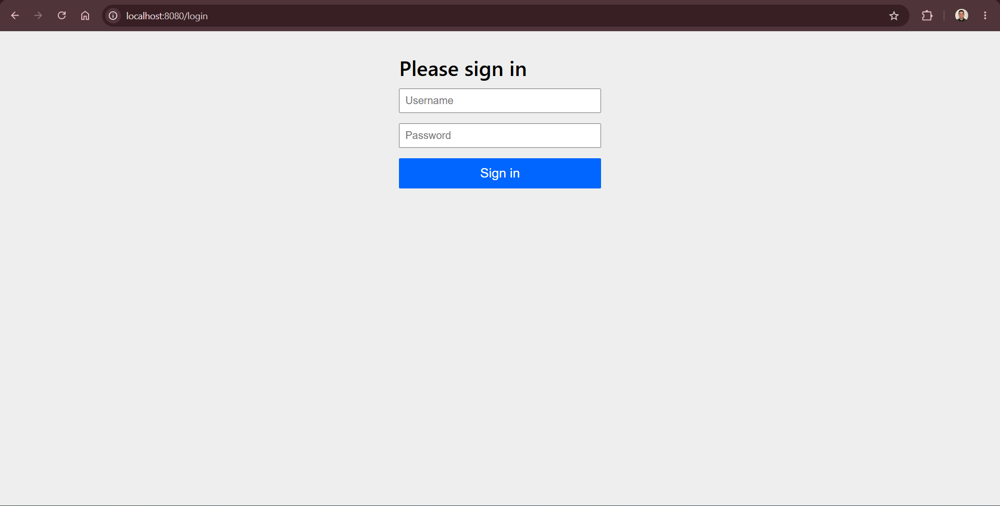
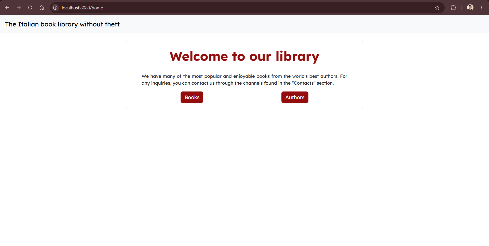
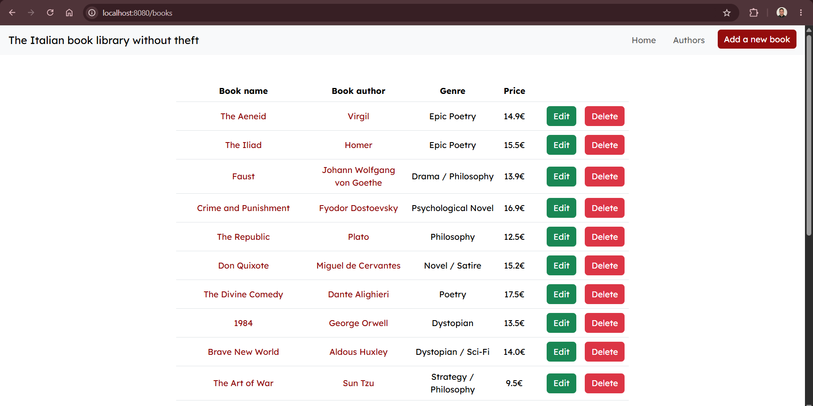
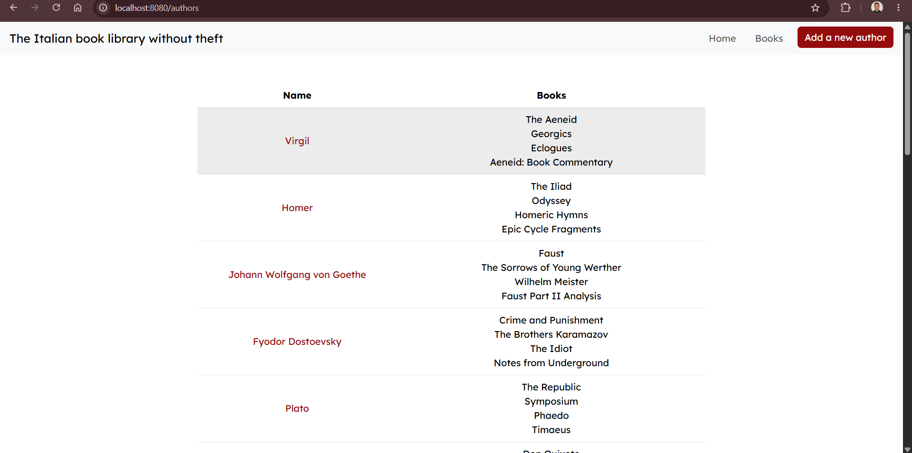
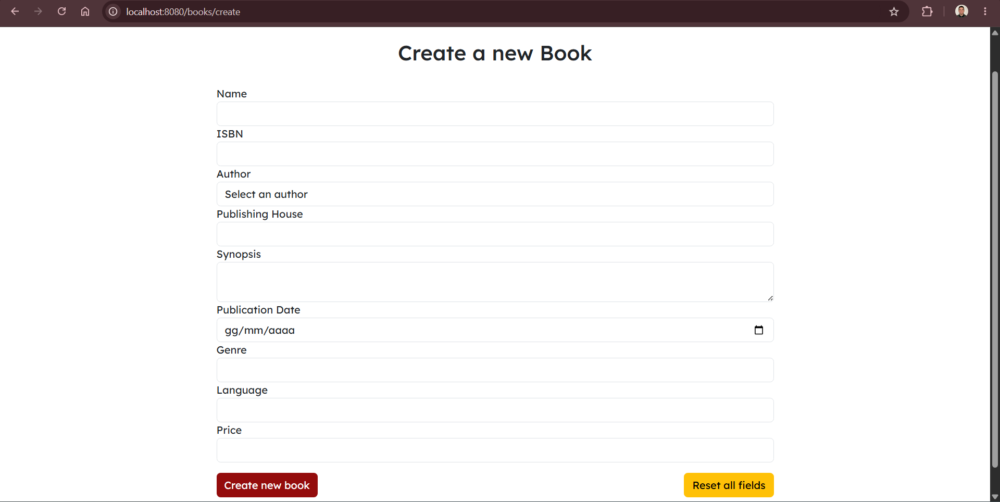
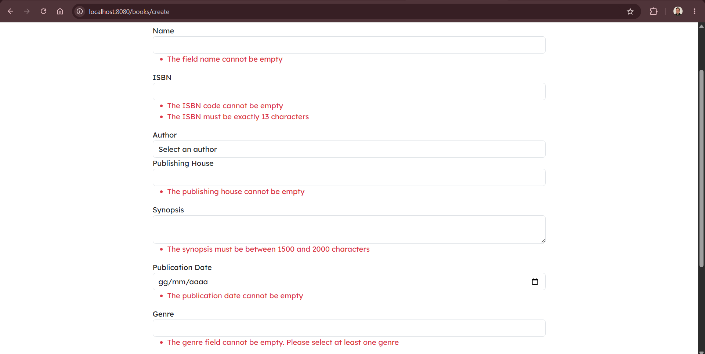

# Java REST Api

A Java application created to manage a virtual library with a list of books and authors. The application is divided into Java for the back-end and React for the front-end.

## Description

This application features a login interface; by entering admin data, you can view books as normal, edit and delete them, view and add new authors, or delete them.

If you enter guest data, the application will only allow you to view books and authors.

The application features a clean and easy-to-navigate UI, featuring a dynamic Navbar that changes based on the page you're on.

The creation page for both authors and books includes error handling for each input field that tells the user exactly what they are doing wrong and how to fix it.

## Technologies

**Front-end**: HTML5, CSS3, JavaScript, React

**Back-end**: Java, Spring Boot

**Database**: MySQL

**Tools**: Git, npm, Maven, Visual Studio Code

## Screenshot

### Login page

### Home page

### Books page

### Authors page

### Create page

### Errors handling
